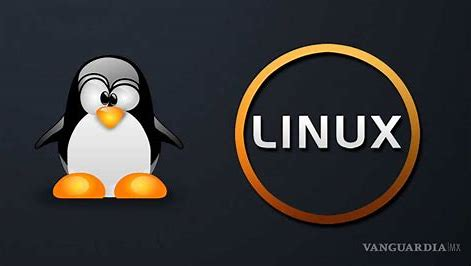
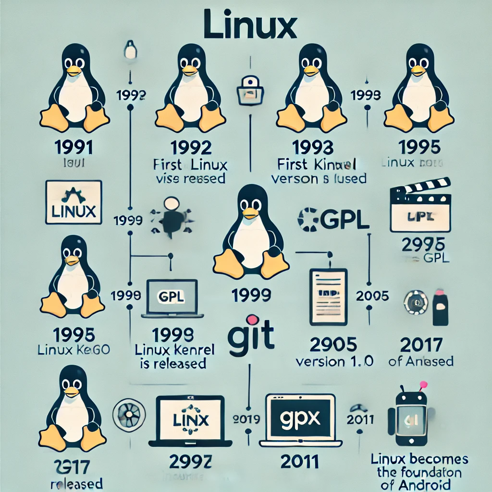
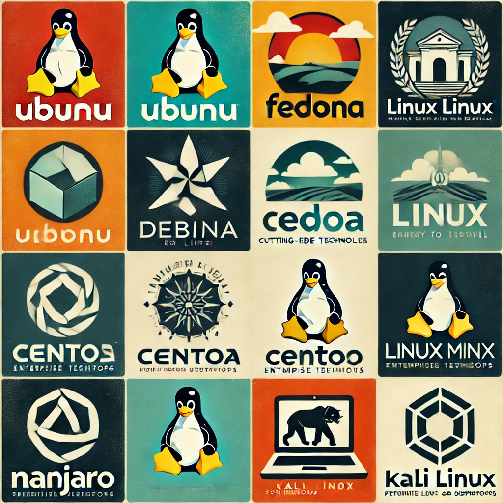
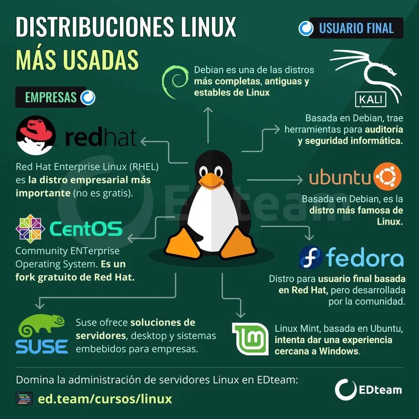
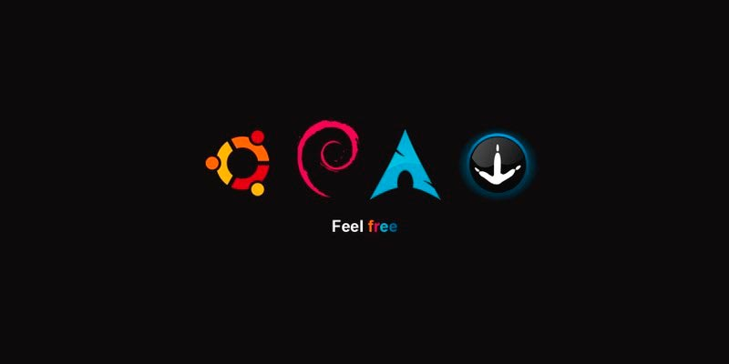
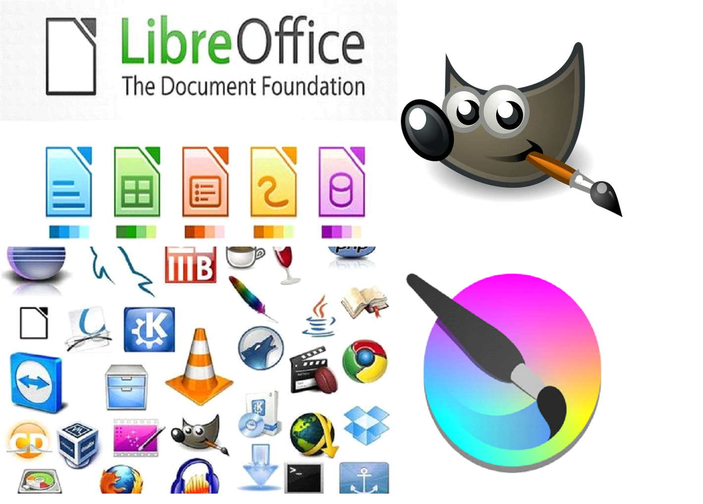

 

# LINUX

## HISTORIA

Linus Benedict Torvaldses un ingeniero de software finlandés-estadounidense,​ conocido por iniciar y mantener el desarrollo del kernel Linux(credaor de linux)

Linux es un sistema operativo de código abierto que se originó en 1991, cuando Linus Torvalds, un estudiante de informática de la Universidad de Helsinki, comenzó a programar sus primeras líneas de código. 
 
Torvalds se basó en el sistema operativo libre Minix, creado por Andrew S. Tanenbaum en 1987, y en los programas del proyecto GNU. Torvalds se frustró con las limitaciones de uso de Minix, que solo se permitía para uso educativo, por lo que decidió desarrollar su propio núcleo

- La evolución de Linux ha sido notable desde su inicio como un proyecto estudiantil hasta convertirse en un sistema operativo dominante. A continuación, se presentan algunos hitos de su desarrollo: 
 
1991: Linus Torvalds, un estudiante finlandés, anuncia públicamente el núcleo de Linux. 
 
1992: Linux se convierte en código abierto y cambia su licencia a la GPL de GNU. 
 
1993: Más de 100 desarrolladores trabajan en el núcleo de Linux. 
 
1994: Torvalds lanza la versión 1.0 de Linux, considerando que todos los componentes del núcleo estaban maduros. 
 
1995: Linux se porta a la arquitectura DEC Alpha y a la Sun SPARC. 
 
1996: Se lanza la versión 2.0 del núcleo de Linux. 
 
1998: Empresas como IBM, Compaq y Oracle anuncian su apoyo a Linux

- Algunos errores notables en la historia de Linux son:

- Race Condition en "ptrace()" en 2003:

Este error en la llamada al sistema "ptrace()" permitía a los usuarios locales elevar sus privilegios a los de root. Fue una vulnerabilidad crítica que expuso muchos sistemas a posibles compromisos de seguridad hasta que fue corregida.

- Exploit en "mremap()" en 2004:

Un error en la función "mremap()" del kernel permitió una vulnerabilidad que podía ser explotada para obtener privilegios de root. Este exploit fue particularmente peligroso porque era trivial de ejecutar, afectando a numerosas versiones de Linux en ese momento.

- Exploit en "vmsplice()" en 2008:

Este error en la llamada al sistema "vmsplice()" permitía a un usuario local ganar privilegios de root, afectando a múltiples versiones del kernel Linux. Este exploit fue ampliamente explotado en la naturaleza antes de que se corrigiera.

   

# Filososfia de Software Open Source
- La filosofía del software open source se basa en la idea de que el código fuente de un programa debe estar disponible para cualquier persona que quiera verlo, modificarlo y redistribuirlo. Esto contrasta con el software propietario, donde el código fuente está cerrado y controlado por una empresa o individuo. El open source promueve la colaboración, la transparencia y la libertad tecnológica.

<dlv aling="center">

 
 # Sistemas operativos de Linux

 

Cada versión del sistema operativo Linux gestiona los recursos de hardware, lanza y gestiona las aplicaciones, y proporciona alguna forma de interfaz de usuario. La enorme comunidad de desarrollo y la amplia gama de distribuciones significa que una versión de Linux está disponible para casi cualquier tarea, y Linux ha penetrado en muchas áreas de la informática.

Pero realmente son los muchos los desarrolladores externos y proyectos GNU los que ofrecen funciones de alto nivel al kernel de Linux para proporcionar un sistema operativo completamente realizado. Por ejemplo, hay módulos para proporcionar una interfaz de línea de comandos, implementar una interfaz gráfica de usuario, administrar la seguridad, ofrecer servicios de entrada de video o audio, y muchos otros, cada uno de los cuales puede ser modificado y optimizado para formar distribuciones únicas para tareas específicas.

El software del gestor de paquetes suele agregar, actualizar o eliminar componentes de software bajo el sistema operativo Linux. Ejemplos de gestores de paquetes incluyen dpkg, OpenPKG, RPM Package Manager y Zero Install. 

### Aqui una guia rapida de como instalar Linux Ubuntu

[Video](https://www.youtube.com/watch?v=qdRXIePtGY8)

## GESTION DE LA INTERFAZ GRAFICA

En Linux, la gestión de la interfaz gráfica depende del entorno de escritorio (como GNOME, KDE Plasma, XFCE, etc.) y del gestor de ventanas (como Mutter, KWin, Xfwm).

1. ### Manejo de Ventanas y Organización

El manejo de ventanas y su organización varía ligeramente entre los entornos de escritorio, pero en general, Linux permite una gestión muy flexible a través de diferentes gestores de ventanas. A continuación, algunos conceptos clave:

- Atajos de teclado para la gestión de ventanas:

- Super (Windows key) + Tab: Alterna entre las ventanas abiertas.
- Alt + Tab: Navega entre aplicaciones activas.
- Super + flechas de dirección: Mueve las ventanas hacia los bordes o maximiza/minimiza en GNOME y KDE.
- Super + Shift + flechas de dirección: En algunos entornos, mueve la ventana a otro monitor.
- Super + D: Muestra el escritorio.

2. ### 3. Asistente de Voz Integrado (si aplica)
Los sistemas Linux no suelen tener un asistente de voz preinstalado como Cortana en Windows o Siri en macOS, pero es posible instalar asistentes de voz de código abierto como:

- Mycroft AI: Un asistente de voz de código abierto compatible con Linux. Se puede instalar y configurar para realizar diversas tareas mediante comandos de voz.

3. ### 4. Comandos o Atajos Clave en Linux (Interfaz Gráfica)

En el entorno gráfico, hay muchos atajos y comandos útiles. Algunos comunes incluyen:

- Alt + F2: Abre un diálogo de ejecución rápida de comandos (en GNOME o KDE).
- Super (Windows Key): Abre el menú de aplicaciones o el lanzador de actividades.
- Super + L: Bloquea la pantalla.
- Super + M: Muestra el centro de notificaciones.
- Ctrl + Alt + T: Abre una nueva ventana de terminal.
- Super + Esc o Ctrl + Esc: Muestra el monitor de sistema o el gestor de tareas (depende del entorno).

Cada entorno de escritorio en Linux tiene sus propios atajos y funcionalidades adicionales, pero estos son los más comunes en las interfaces gráficas estándar.

 

# DISTRIBUCIONES DE LINUX
Las distribuciones de Linux son variaciones del sistema operativo Linux, cada una adaptada para diferentes usos y usuarios.

- Ubuntu: Ideal para principiantes, fácil de usar, popular en escritorios y servidores.
- Fedora: Innovadora, para desarrolladores y usuarios avanzados, con las últimas tecnologías.
- Arch Linux: Minimalista y personalizable, para usuarios avanzados que desean control total.
- Debian: Estable y segura, preferida en servidores y estaciones de trabajo.
- CentOS: Gratuita y estable, popular en entornos empresariales como alternativa a RHEL.
- Linux Mint: Fácil de usar, ideal para quienes migran de Windows, con una experiencia familiar.
- OpenSUSE: Versátil y robusta, para servidores y escritorios, conocida por sus herramientas de administración.
- Kali Linux: Diseñada para pruebas de penetración y seguridad informática.
- Manjaro: Basada en Arch Linux, pero más amigable y fácil de instalar, para usuarios de todos los niveles.

   
   

# PERSONALIZACION EN LINUX

Linux es conocido por su alto nivel de personalización, que permite a los usuarios modificar prácticamente todos los aspectos del sistema. A continuación, te presento los niveles de personalización posibles en Linux y algunas herramientas para lograrlo:

Personalización Básica: 
- Cambiar temas, íconos, fondos de pantalla.
- Herramientas: GNOME Tweaks, KDE System Settings.

Personalización Intermedia:
- Cambiar entornos de escritorio (GNOME, KDE, XFCE).
- Configurar aplicaciones y servicios de inicio.

Personalización Avanzada:
- Construir el sistema desde cero (Arch, Gentoo).
- Personalizar la terminal y shells (Bash, Zsh).

Personalización Extrema:
- Compilar un núcleo personalizado.
- Usar gestores de paquetes personalizados (AUR, ebuilds).

Interfaz de Usuario:
- Crear widgets y monitores de sistema (Conky).
Aplicaciones:
- Elegir e instalar software específico según tus necesidades.

Aqui un video de personalizacion de Linux:https://www.youtube.com/watch?v=OqR7vttpITs 

# INSTALACION DE APLICACIONES EN LINUX

La instalación de aplicaciones en Linux puede realizarse de diferentes maneras, principalmente a través de gestores de paquetes o compilando desde el código fuente.

### 1. Gestores de Paquetes:

Los gestores de paquetes son herramientas que automatizan la instalación, actualización y eliminación de software en Linux. Trabajan descargando paquetes (archivos que contienen el software) desde repositorios oficiales o de terceros.

- APT (Advanced Package Tool):
Uso: Utilizado en distribuciones basadas en Debian, como Ubuntu.
Comando básico: sudo apt install nombre_del_paquete
- YUM/DNF:
Uso: YUM es el gestor de paquetes en distribuciones basadas en Red Hat, como CentOS y Fedora (DNF es su sucesor).
Comando básico: sudo dnf install nombre_del_paquete (Fedora) o sudo yum install nombre_del_paquete (CentOS)
- Pacman:
Uso: Usado en Arch Linux y sus derivadas.
Comando básico: sudo pacman -S nombre_del_paquete
- Zypper:
Uso: Utilizado en OpenSUSE.
Comando básico: sudo zypper install nombre_del_paquete

 

### 2. Instalación desde Código Fuente:

Instalar desde el código fuente implica descargar el código original de la aplicación y compilarlo manualmente. Este método es más flexible, pero también más complejo.

Pasos Básicos:

1. Descargar el código fuente: Generalmente desde el sitio web oficial o GitHub.
2. Extraer los archivos: Si está comprimido, usar tar -xvf archivo.tar.gz.
3. Configurar: Preparar el entorno con ./configure.
4. Compilar: Convertir el código en un programa ejecutable con make.
5. Instalar: Copiar los archivos necesarios al sistema con sudo make install.

#### Ventajas:

 -  Permite personalizar la instalación con opciones específicas.
-  Útil para software que no está disponible en los repositorios.
#### Desventajas:

- Requiere más tiempo y conocimientos técnicos.
- No gestiona automáticamente las dependencias como lo hacen los gestores de paquetes.

### Diferencias Clave:

- Facilidad de Uso: Los gestores de paquetes son más fáciles y rápidos, manejando automáticamente dependencias y actualizaciones. La instalación desde código fuente es más laboriosa y requiere conocimientos técnicos.

- Flexibilidad: Instalar desde código fuente permite personalizar la compilación, como optimizar para tu hardware o incluir/excluir ciertas características.

- Disponibilidad: Algunas aplicaciones más nuevas o especializadas pueden no estar en los repositorios y necesitan ser instaladas desde el código fuente.

En resumen, los gestores de paquetes son la opción preferida para la mayoría de los usuarios debido a su simplicidad y eficiencia, mientras que la instalación desde el código fuente es ideal para quienes necesitan un control más detallado o para software no disponible en los repositorios.

### Aplicaciones Famosas y Exclusivas del Sistema Operativo:

Cada sistema operativo (Linux, Windows, macOS) tiene aplicaciones que son emblemáticas o exclusivas debido a su diseño o compatibilidad con la plataforma:

- GIMP: Alternativa a Photoshop para edición de imágenes.
- Krita: Aplicación avanzada de dibujo y pintura digital.
- LibreOffice: Suite ofimática completa.
- VLC: Reproductor multimedia versátil (disponible también en otros sistemas).
- Konsole y GNOME Terminal: Emuladores de terminal.
- Kdenlive y Blender: Para edición de video y modelado 3D.

  

### Extensiones de Archivos Comunes para la Instalación:
Cada sistema operativo usa diferentes extensiones de archivo para instalar y distribuir software:

- .deb: Paquetes para distribuciones basadas en Debian (como Ubuntu).
- .rpm: Paquetes para distribuciones basadas en Red Hat (Fedora, CentOS).
- .AppImage: Paquete portátil que no requiere instalación.
- .tar.gz/.tar.xz: Archivos comprimidos que contienen el código fuente o el software para ser instalado manualmente.

