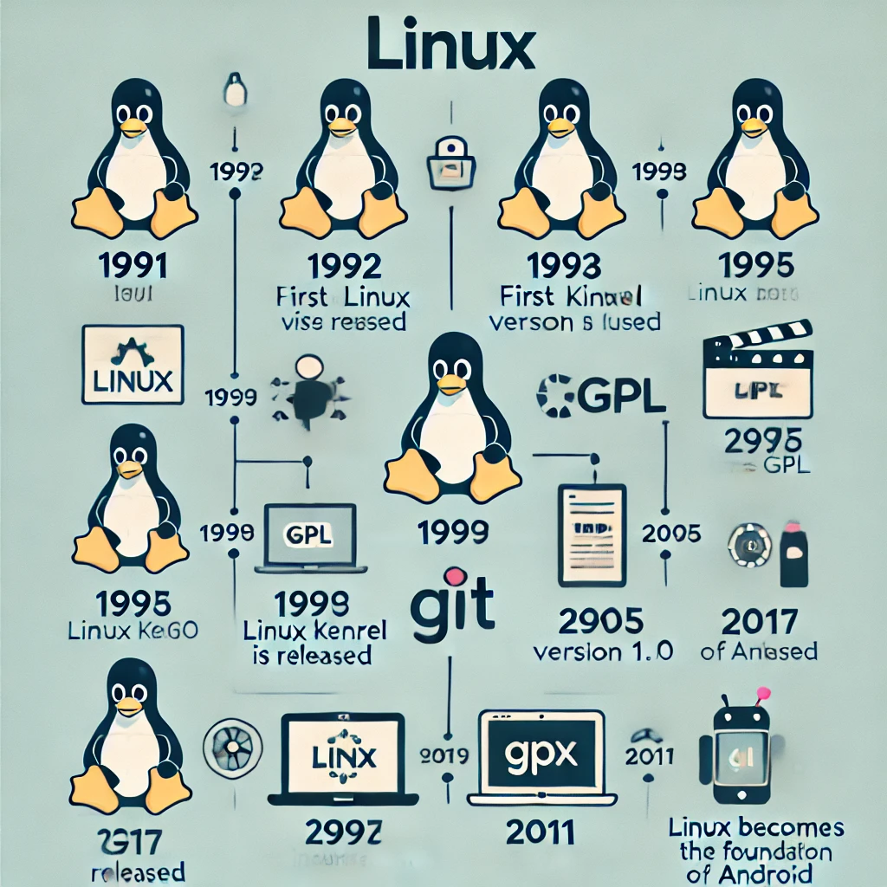

# linux

- Linus Benedict Torvaldses un ingeniero de software finlandés-estadounidense,​ conocido por iniciar y mantener el desarrollo del kernel Linux

- Linux es un sistema operativo de código abierto que se originó en 1991, cuando Linus Torvalds, un estudiante de informática de la Universidad de Helsinki, comenzó a programar sus primeras líneas de código. 
 
Torvalds se basó en el sistema operativo libre Minix, creado por Andrew S. Tanenbaum en 1987, y en los programas del proyecto GNU. Torvalds se frustró con las limitaciones de uso de Minix, que solo se permitía para uso educativo, por lo que decidió desarrollar su propio núcleo

- La evolución de Linux ha sido notable desde su inicio como un proyecto estudiantil hasta convertirse en un sistema operativo dominante. A continuación, se presentan algunos hitos de su desarrollo: 
 
1991: Linus Torvalds, un estudiante finlandés, anuncia públicamente el núcleo de Linux. 
 
1992: Linux se convierte en código abierto y cambia su licencia a la GPL de GNU. 
 
1993: Más de 100 desarrolladores trabajan en el núcleo de Linux. 
 
1994: Torvalds lanza la versión 1.0 de Linux, considerando que todos los componentes del núcleo estaban maduros. 
 
1995: Linux se porta a la arquitectura DEC Alpha y a la Sun SPARC. 
 
1996: Se lanza la versión 2.0 del núcleo de Linux. 
 
1998: Empresas como IBM, Compaq y Oracle anuncian su apoyo a Linux

- Algunos errores notables en la historia de Linux son:

- Race Condition en "ptrace()" en 2003:

Este error en la llamada al sistema "ptrace()" permitía a los usuarios locales elevar sus privilegios a los de root. Fue una vulnerabilidad crítica que expuso muchos sistemas a posibles compromisos de seguridad hasta que fue corregida.

- Exploit en "mremap()" en 2004:

Un error en la función "mremap()" del kernel permitió una vulnerabilidad que podía ser explotada para obtener privilegios de root. Este exploit fue particularmente peligroso porque era trivial de ejecutar, afectando a numerosas versiones de Linux en ese momento.

- Exploit en "vmsplice()" en 2008:

Este error en la llamada al sistema "vmsplice()" permitía a un usuario local ganar privilegios de root, afectando a múltiples versiones del kernel Linux. Este exploit fue ampliamente explotado en la naturaleza antes de que se corrigiera.

   

# Filososfia de Software Open Source
- La filosofía del software open source se basa en la idea de que el código fuente de un programa debe estar disponible para cualquier persona que quiera verlo, modificarlo y redistribuirlo. Esto contrasta con el software propietario, donde el código fuente está cerrado y controlado por una empresa o individuo. El open source promueve la colaboración, la transparencia y la libertad tecnológica.

<dlv aling="center">

 
 
 
 
 
 
 
 
 

